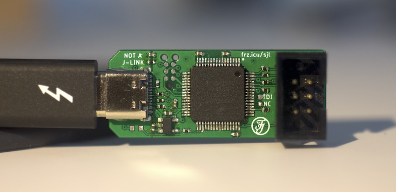

# Not A J-Link

Replacement board for the J-Link EDU mini that features a power supply for the target device. It allows you to directly connect a programming probe or proper 2.54mm jumper wires without any adaptors and it features a USB-C port. The chip on the board was carefully removed from a genuine J-Link, so its firmware is still original.

## Partlist

C1, C2, C4, C5, C6: 100nF 0402
C8, C9:             2.2µF 0402
D1:                 LED 0603
R1, R2:             5k1 0402
R3, R4:             33Ω 0402
R7:                 10k 0402
R8:                 220Ω 0402
R9 - R13:           150Ω 0402
U$2:                TLV75533PDBVR (better: TLV75733PDBVR)
IC1:                MK22FN128VLH10 (MCU from J-Link)
J3                  6P Box Header
J1                  USB-C or USB-A plug